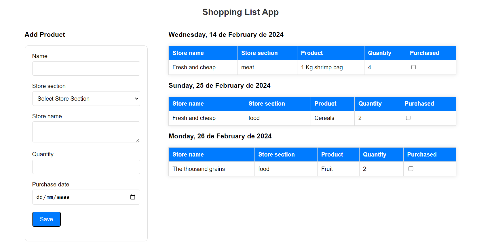

# Shopping List App

Web application that allows us to keep track of the products we need to buy at the supermarket and mark those that have already been purchased.

## Requirements

* Ruby 3.2.3
* Rails 7.1.3
* SQLite

## Installation

* Clone this repository
* Run `bundle install` to install al project gems
* Run `rails db:setup` to init the database tables and seed them
* Run `rails server`

## Project Structure

*  `models/product.rb`: Validations are specified. Additionally, a method returns a hash containing dates and the products pending for purchase.

*  `controllers/products_controller.rb`: Handles methods for creating and marking purchased products.

*  `javascript/controllers/product_controller.js`:  Stimulus controller designed to send a fetch request, updating the purchase status of a product.

*  `views/products/index.html.erb`: Displays the form and pending purchase products grouped by date.

### View Components

1. **ProductCardComponent:** Displays all the details of the product.

2. **ProductFormComponent:** Form for creating a new product.

3. **GroupOfProductsComponent:** Represent the grouping of products that have to be purchased on the same day.

## Gems added

* `view_component`: Used to organize and modularize user interface components.
* `rspec-rails`:  Integration with RSpec, testing framework.
* `factory_bot_rails`:  Creation of test data for models.
* `faker`:  Generate fake data.
